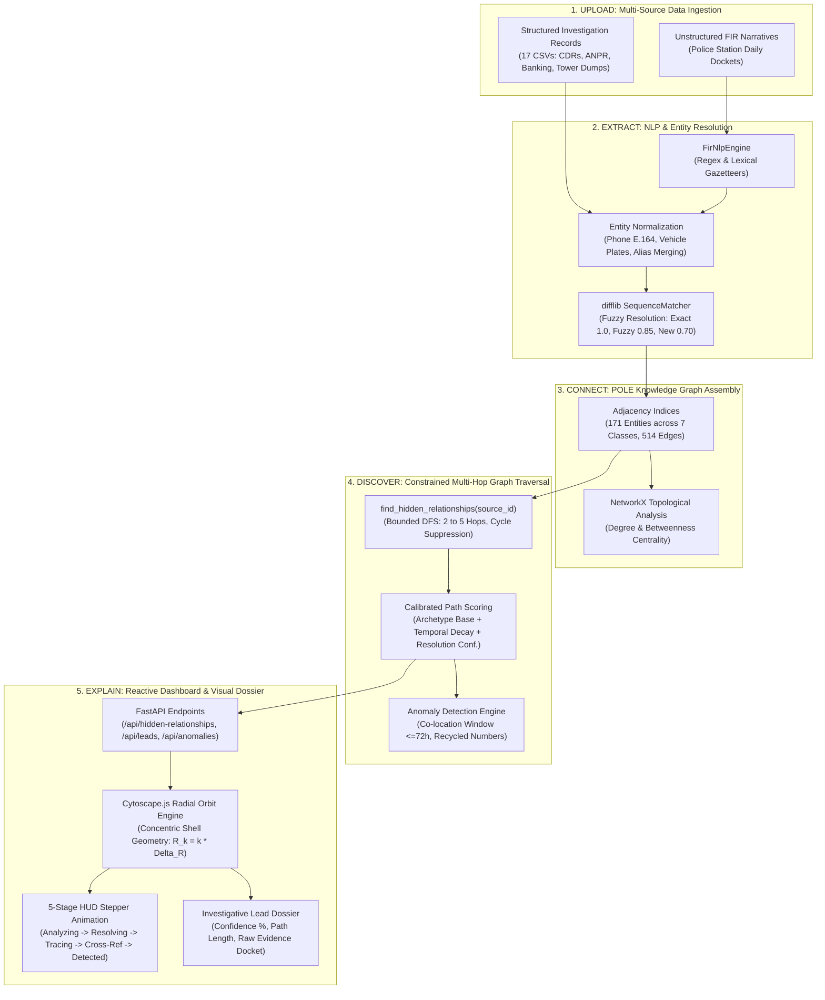

# CYPHER: AI-Powered Criminal Network Analysis System
## Comprehensive System Specification & Algorithmic Blueprint
**Smart India Hackathon 2026 | Problem Statement ID: 26189**  
**Theme: Blockchain & Cybersecurity | Category: Software | Team Name: NarCodes**  
*Motto: "Connecting the Dots that Matter" — "From Hours of Manual Cross-Referencing to Connected Investigative Intelligence"*

---

## 1. Executive Context & Problem Statement

### 1.1 The Operational Challenge
According to the National Crime Records Bureau (**NCRB Crime in India 2023** report), Indian law enforcement agencies handle an immense volume of cases annually:
* **62,41,569 Cognizable Crimes Registered**
* **53,61,518 IPC Cases Under Active Investigation**
* **37,85,839 IPC Cases Disposed by Police**

Investigators are overwhelmed by massive, fragmented data silos: First Information Reports (FIRs), Call Detail Records (CDRs), Automatic Number Plate Recognition (ANPR) logs, banking transaction dockets, cell tower dumps, and suspect dossiers. 

### 1.2 Real-World Case Anchor: The Siya Goyal Case
As highlighted in investigative records (e.g., *India Today* / Siya Goyal case), what initially appeared as an accidental death required investigators to spend hundreds of grueling hours piecing together scattered CCTV footage, telephone call logs, digital forensics, physical witness statements, and temporal timelines before uncovering foul play and developing the case into an alleged murder investigation.

> [!IMPORTANT]
> **The Core Problem**: Time is lost manually connecting the dots across disparate records. Manual cross-referencing is slow, error-prone, and causes critical multi-hop relationships to be overlooked.  
> **Cypher's Core Solution**: Cypher ingests multi-source data, automatically extracts and resolves entities using the POLE (Person, Object, Location, Event) framework, constructs an intelligence knowledge graph, and surfaces 2–5 hop hidden connections with verifiable evidence in seconds.

### 1.3 Investigative Ethics & Decision-Support Philosophy
* **Not "Who is guilty?"**: The platform never automates judicial findings or predicts criminal guilt.
* **Instead: "What relationship deserves investigation?"**: Cypher surfaces high-priority, evidence-backed connections for human review.
* **Mandatory Directive**: Every lead enforces the strict alert: `⚠ HUMAN VERIFICATION REQUIRED`.
* **Full Evidence Provenance**: Every link displays its raw source (`#CDR-XXXX`, `#TXN-XXXX`, `#VEH-XXXX`, `#LOC-XXXX`).

---

## 2. Complete End-to-End Program Flow

Cypher operationalizes the 5-step operational pipeline defined in the presentation:  
$$\text{UPLOAD} \longrightarrow \text{EXTRACT} \longrightarrow \text{CONNECT} \longrightarrow \text{DISCOVER} \longrightarrow \text{EXPLAIN}$$



### Detailed Lifecycle Stages:
1. **Upload & Ingestion**:
   - `IntelGraphEngine._load_from_csv_directory()` ingests 17 normalized relational tables.
   - Unstructured narrative text from `fir_reports.csv` is streamed into `FirNlpEngine`.
2. **Extract & Entity Resolution**:
   - Regex patterns extract Indian mobile numbers (`+91` 10-digit series), motor vehicle plates (`DL`, `UP`, `HR`), timestamps, and person entities preceded by legal action verbs (*"arrested"*, *"questioned"*, *"statement of"*).
   - Fuzzy matching compares strings against existing canonical records; resolves matching personas while preventing subgraph fragmentation.
3. **Connect (POLE Knowledge Graph)**:
   - Assembles Person, Object (Phones, Vehicles, Bank Accounts), Location, and Event (Cases, Transactions, Meetings) entities into unified in-memory adjacency maps (`self.adj`, `self.edge_map`).
   - NetworkX computes global topological indicators (Degree and Betweenness Centrality).
4. **Discover (Constrained Multi-Hop Traversal)**:
   - When an investigator selects a focal person or case, bounded DFS traces outward from 2 up to 5 hops.
   - Cycle suppression eliminates infinite loops; direct 1-hop edges are pruned (since investigators already know direct contacts); domain chain constraints prevent path flooding.
   - Scored candidate paths are categorized into investigative archetypes.
5. **Explain (Traceable Intelligence Presentation)**:
   - FastAPI serializes the enriched path payloads with confidence ratings and supporting record IDs.
   - Cytoscape.js projects the graph onto the viewport using concentric radial orbits.
   - The HUD stepper sequentially illuminates the discovery path node-by-node and presents the evidence dossier.

---

## 3. Algorithms Employed & Mathematical Formulations

```
+---------------------------------------------------------------------------------------------------+
|                                      ALGORITHMIC STACK OVERVIEW                                   |
+------------------------------------+----------------------------------+---------------------------+
| 1. Constrained Graph Traversal     | 2. Archetype & Confidence Score  | 3. Structural Analytics   |
|    - Bounded DFS (2-5 hops)        |    - Multi-factor heuristic      |    - Degree Centrality    |
|    - Cycle suppression             |    - Temporal decay weighting    |    - Betweenness Centrality|
|    - Direct-edge pruning           |    - Resolution confidence       |    - Bridge detection     |
+------------------------------------+----------------------------------+---------------------------+
| 4. Deterministic NLP / Resolution  | 5. Anomaly Detection             | 6. Visual Layout Engine   |
|    - Regex + Gazetteers            |    - Rendezvous window check     |    - Concentric orbits    |
|    - Levenshtein / SequenceMatcher |    - Recycled SIM detection      |    - Sequential stepper   |
+------------------------------------+----------------------------------+---------------------------+
```

### 3.1 Constrained Multi-Hop Graph Traversal (Bounded DFS)
* **Objective**: Surface non-obvious, multi-step connections between a starting entity $S$ and an unknown target $T$.
* **How It Works**:
  1. Traverses outward via depth-first search bounded to $2 \le \text{hops} \le 5$.
  2. **Cycle Suppression**: Re-visitation of any node in the active path branch aborts that branch immediately.
  3. **Direct-Edge Pruning**: If $(S, T)$ has a direct 1-hop edge in the graph, $T$ is discarded as a hidden relationship target.
  4. **Domain Chain Limits**: Constrains consecutive telecom hops (`COMMUNICATED_WITH` $\le 2$) or banking hops (`TRANSFERRED_FUNDS` $\le 2$) to avoid trivial hub-traversal through massive call centers or public payroll accounts.

### 3.2 Calibrated Multi-Factor Path Scoring & Confidence Heuristics
* **Objective**: Rank discovered paths so the most critical investigative leads appear first.
* **Mathematical Formula**:
  $$\text{Path Score} = \text{Archetype Base} + 2.0 \cdot \bar{C}_{\text{resolution}} + \text{Compactness} + \text{Target Priority}$$
  $$\text{Confidence Score} = \min\left(0.98, \, \max\left(0.60, \, \bar{C}_{\text{resolution}} \cdot \left[1.0 - 0.04 \cdot \max(0, \text{hops} - 2)\right]\right)\right)$$

* **Archetype Scoring Matrix**:

| Archetype Pattern | Hops | Structural Configuration | Archetype Base Score |
| :--- | :---: | :--- | :---: |
| **Location Temporal Rendezvous** | 2 hops | Person $\to$ Location $\to$ Person (within 72-hour window) | $13.0 - \left(\frac{\Delta t_{\text{hours}}}{72.0} \times 0.4\right)$ |
| **Shared Vehicle to Case** | 3 hops | Person $\to$ Vehicle $\to$ Associate/POI $\to$ Case Dossier | $12.0 + \text{Role Bonus}$ ($+1.5$ for POI/Suspect) |
| **Organization Bridge to Case** | 3 hops | Person $\to$ Org $\to$ Associate/Colleague $\to$ Case Dossier | $12.0 + \text{Role Bonus}$ ($+1.5$ for POI/Suspect) |
| **Direct Financial Bridge** | 3 hops | Person $\to$ Bank Account 1 $\to$ Bank Account 2 $\to$ Person | $12.6$ (outgoing) / $10.5$ (incoming) |
| **Comm & Surveillance Asset Conduit**| 5 hops | Person $\to$ Phone 1 $\to$ Phone 2 $\to$ Middleman $\to$ Vehicle $\to$ Person | $12.2 + 0.5$ (surveillance bonus) |
| **Reassigned Phone Cross-Case** | 5 hops | Case 1 $\to$ Person 1 $\to$ Recycled Number $\to$ Person 2 $\to$ Case 2 | $12.5$ |

* **Compactness Bonus**: $\max(0, 5 - \text{hops}) \times 0.1$ (prioritizes shorter, more direct chains).
* **Target Priority**: $+1.0$ if target is a `PERSON` or `CASE`; $+0.5$ otherwise.

### 3.3 Structural Graph Centrality & Bridge Detection (NetworkX)
* **Degree Centrality**:
  $$C_D(v) = \frac{\deg(v)}{|V| - 1}$$
  Identifies key coordinators, high-volume telecom hubs, and multi-asset owners.
* **Betweenness Centrality**:
  $$C_B(v) = \sum_{s \neq v \neq t} \frac{\sigma_{st}(v)}{\sigma_{st}}$$
  Quantifies how often entity $v$ acts as a bridge along shortest paths between all entity pairs. Highlights covert couriers and cut-vertices connecting criminal sub-gangs.

### 3.4 Deterministic NLP & Entity Resolution (FIR Ingestion)
* **Regex Extractors**:
  - Phone numbers: `(?:\+91[-\s]?|0)?([6-9]\d{9})\b`
  - Vehicle plates: `\b([A-Z]{2}[-\s]?\d{1,2}[-\s]?[A-Z]{1,3}[-\s]?\d{4})\b`
  - Temporal anchors: ISO dates, formal narratives, and military times (`1430 hours`, `11:30 HRS`).
* **Fuzzy Resolution Calibration**:
  - Exact match $\to 1.00$
  - Normalized clean string match $\to 0.95$
  - Fuzzy string similarity (`difflib.SequenceMatcher` $\ge 0.85$) $\to 0.85$
  - New entity instantiation $\to 0.70$.

### 3.5 Radial Orbit Visual Geometry Layout Algorithm
* Focal source node is anchored at the origin $(0, 0)$.
* Nodes at hop level $k$ ($1 \le k \le 5$) are placed on concentric orbital rings of radius $R_k = k \times \Delta R$:
  $$\theta_i = \frac{2\pi \cdot i}{N_k} + \phi_k, \quad x_i = R_k \cos(\theta_i), \quad y_i = R_k \sin(\theta_i)$$
* Provides a clean radar-style HUD interface that makes complex multi-hop paths immediately legible.

---

## 4. Technology Stack: Current Prototype vs. Future Roadmap

*Aligned with Slide 3 ("Technical Approach: Tech Stack") and Slide 4 ("Feasibility and Viability"):*

```
+---------------------------------------------------------------------------------------------------------+
|                                    TECHNOLOGY STACK COMPARISON                                          |
+----------------------+---------------------------------------+------------------------------------------+
| Layer / Subsystem    | Current Prototype (Active)            | Future Scale Implementation (Roadmap)    |
+----------------------+---------------------------------------+------------------------------------------+
| **Graph Database**   | NetworkX 3.4 + In-Memory Adjacency    | **Neo4j Enterprise / Memgraph** (Cypher) |
| **Backend API**      | **Python 3.10+, FastAPI, Uvicorn**    | **FastAPI + Go Microservices**           |
| **Data Validation**  | **Pydantic v2, REST / JSON**          | **Pydantic v2 + Protobuf / gRPC**        |
| **Data Processing**  | **pandas, NumPy**                     | **pandas, Apache Spark / Polars**        |
| **Graph ML**         | Centrality, Bounded DFS, Heuristics   | **PyG (PyTorch Geometric) / DGL** (GNNs) |
| **Statistical ML**   | Heuristic threshold formulas          | **scikit-learn** (Isolation Forests)     |
| **NLP & Extraction** | Deterministic Regex + Difflib         | **Hugging Face Transformers / IndicBERT**|
| **Search Engine**    | In-memory hash indexing               | **Elasticsearch / OpenSearch**           |
| **Streaming Queue**  | Synchronous in-memory pipeline        | **Apache Kafka + Celery / Redis**        |
| **Storage Layer**    | 17 Relational CSV tables + JSON       | **PostgreSQL + TimescaleDB + PostGIS**   |
| **Frontend Core**    | **React 18 (TypeScript), Vite, HTML5**| **React 18 / Next.js Enterprise SPA**    |
| **UI & Styling**     | **Tailwind CSS, Lucide Icons**        | **Tailwind CSS + WebGL HUD Components**   |
| **Visualization**    | **Cytoscape.js (Canvas / WebGL)**     | **Cytoscape.js + WebGPU Force Layouts**  |
| **Deployment / CI**  | **Netlify, Vercel, GitHub Actions**   | **Docker, Kubernetes (K8s), AWS GovCloud**|
| **Govt. Integration**| Synthetic CCTNS/ICJS schemas           | **Authorized CCTNS / ICJS Live APIs**    |
+----------------------+---------------------------------------+------------------------------------------+
```

---

## 5. Comprehensive Dataset Analysis

The dataset models law enforcement operations across 17 relational tables adhering to Indian POLE conventions.

### 5.1 Global Data Counts
* **Total Relational CSV Tables**: 17 tables
* **Total CSV Records**: 879 records
* **Total Canonical Graph Entities**: **171 entities**
* **Total Graph Edges**: **514 directed/bidirectional relationships**
* **Total Evidentiary Records**: **661 verifiable source records**

### 5.2 Entity Breakdown (171 Total Entities)
```
  Entity Type       Count   Role in Investigation System
  ----------------  -----   --------------------------------------------------------------
  PERSON               45   Suspects, Persons of Interest (POIs), Associates, Witnesses
  PHONE                40   Active mobile numbers, IMEI devices, Reassigned SIM records
  BANK ACCOUNT         27   Savings, Current, Overdraft accounts across Indian banks
  LOCATION             18   Transit hubs, bus terminals, meeting points, safehouses
  VEHICLE              18   Registered four-wheelers, commercial trucks, motorcycles
  CASE                 13   Active FIR investigation dockets (fraud, theft, arms, murder)
  ORGANIZATION         10   Commercial entities, shell companies, trade associations
```

### 5.3 Relationship Breakdown (514 Total Edges)
```
  Relationship Type          Count   Evidentiary Basis & Source Table
  -------------------------  -----   ------------------------------------------------------
  COMMUNICATED_WITH            172   communications.csv (Call logs, SMS, Tower triangulations)
  VISITED                       77   person_location_events.csv (Location check-ins, pings)
  INVOLVED_IN                   68   case_person_links.csv, case_vehicle_links.csv
  TRANSFERRED_FUNDS             55   transactions.csv (Inter-bank transaction flows)
  OWNS_PHONE                    40   phones.csv (Registered subscriber ownership)
  HOLDS_ACCOUNT                 30   bank_accounts.csv (Primary account holders)
  EMPLOYED_AT                   28   persons.csv, case_organization_links.csv
  OWNS_VEHICLE                  18   vehicles.csv (Registration authority records)
  ASSOCIATED_WITH               16   case_organization_links.csv
  OPERATES                       7   bank_accounts.csv (Joint operators, authorized signers)
  REASSIGNED_PHONE_NUMBER        2   phones.csv (SIM deactivation and churn re-issue events)
  PRIMARY_USER                   1   person_vehicle_events.csv (Non-owner custodial driver)
```

---

## 6. Ground Truth Hidden Relationships: Planted vs. Recovered

To rigorously validate Cypher's multi-hop discovery capabilities, **6 hidden relationships** were deliberately planted across separate records. None of these connections are stated directly in any single FIR or report.

### 6.1 Performance Benchmark Summary

$$\mathbf{Total \,\, Planted \,\, Relationships: \,\, 6}$$
$$\mathbf{Successfully \,\, Recovered: \,\, 6 \,\, / \,\, 6 \quad (100.0\%)}$$
$$\mathbf{Top\text{-}1 \,\, Recovery \,\, (Rank \,\, \#1): \,\, 2 \,\, / \,\, 6 \quad (33.3\%)}$$
$$\mathbf{Top\text{-}3 \,\, Recovery \,\, (Rank \le 3): \,\, 4 \,\, / \,\, 6 \quad (66.7\%)}$$
$$\mathbf{Top\text{-}5 \,\, Recovery \,\, (Rank \le 5): \,\, 6 \,\, / \,\, 6 \quad (100.0\%)}$$

### 6.2 Detailed Ground Truth Recovery Breakdown

```
+-------+--------+---------------------------------+----------------------------------------+----------+-------+
| ID    | Diff.  | Category                        | Endpoints                              | Status   | Rank  |
+-------+--------+---------------------------------+----------------------------------------+----------+-------+
| GT001 | Hard   | COMM_VEHICLE_BRIDGE             | P003 (Garima) <-> P020 (Shailesh)      | RECOVERED| #4    |
| GT002 | Medium | SHARED_VEHICLE_CASE             | P005 (Rashi)  <-> CASE04 (Vehicle Case)| RECOVERED| #1    |
| GT003 | Hard   | FINANCIAL_BRIDGE                | P007 (Monika) <-> P025 (Konkana)       | RECOVERED| #4    |
| GT004 | Easy   | LOCATION_RENDEZVOUS             | P015 (Sonali) <-> P030 (Akash)         | RECOVERED| #2    |
| GT005 | Hard   | REASSIGNED_PHONE (Cross-Case)   | CASE02 (Fraud)<-> CASE08 (Vehicle Case)| RECOVERED| #2    |
| GT006 | Medium | ORG_BRIDGE_TO_CASE              | P009 (Mandira)<-> CASE03 (Property)    | RECOVERED| #1    |
+-------+--------+---------------------------------+----------------------------------------+----------+-------+
```

#### GT001: Communication & Surveillance Asset Conduit (Difficulty: HARD)
* **Planted Endpoints**: `P003` (Garima Bhattacharya) $\leftrightarrow$ `P020` (Shailesh Arora)
* **Expected Path**: `P003 -> PH003 -> COMM0001 -> PH010 -> P011 -> PVE001/PVE002 -> VH05 -> P020`
* **Recovered Path**: `Garima Bhattacharya` $\to$ `+91 98773-97255 (Garima's Phone)` $\to$ `+91 74989-60600 (Surekha's Phone)` $\to$ `Surekha Bhardwaj` $\to$ `Maruti Swift (DL01-WQ-8995)` $\to$ `Shailesh Arora`
* **Metrics**: **Rank #4** | 5 hops | Score: 15.67 | Confidence: 87%
* **Evidence**: Connects a single short telephone exchange to physical ANPR camera sightings of a shared vehicle.

#### GT002: Shared Vehicle to Case Link (Difficulty: MEDIUM)
* **Planted Endpoints**: `P005` (Rashi Unnikrishnan) $\leftrightarrow$ `CASE04` (Vehicle Related Case)
* **Expected Path**: `P005 -> VH02 -> PVE003/PVE004 -> P012 -> case_person_links -> CASE04`
* **Recovered Path**: `Rashi Unnikrishnan` $\to$ `Hyundai i20 (UP16-AA-1646)` $\to$ `Vihaan Dutta` $\to$ `Vehicle Related Case (CASE04)`
* **Metrics**: **Rank #1** | 3 hops | Score: 16.67 | Confidence: 94%
* **Evidence**: Rashi owns the vehicle; ANPR logs prove Vihaan is the primary operator; Vihaan is charged in CASE04.

#### GT003: Hidden Inter-Account Financial Conduit (Difficulty: HARD)
* **Planted Endpoints**: `P007` (Monika Vaidyanathan) $\leftrightarrow$ `P025` (Konkana Saini)
* **Expected Path**: `P007 -> ACC05 -> TXN0001 -> ACC13 -> P025`
* **Recovered Path**: `Monika Vaidyanathan` $\to$ `Metro Cooperative Bank (ACC05)` $\to$ `State Trust Bank (ACC13)` $\to$ `Konkana Saini`
* **Metrics**: **Rank #4** | 3 hops | Score: 15.78 | Confidence: 95%
* **Evidence**: Neither party communicates directly; linked solely through an isolated inter-bank funds transfer (`TXN0001`).

#### GT004: Location Temporal Rendezvous (Difficulty: EASY)
* **Planted Endpoints**: `P015` (Sonali Raghavan) $\leftrightarrow$ `P030` (Akash Swamy)
* **Expected Path**: `P015 -> PLE001 (visited LOC17) -> LOC17 -> PLE002 -> P030`
* **Recovered Path**: `Sonali Raghavan` $\to$ `Central Interstate Bus Terminal (LOC17)` $\to$ `Akash Swamy`
* **Metrics**: **Rank #2** | 2 hops | Score: 15.93 | Confidence: 96%
* **Evidence**: Both individuals visited the same transit terminal within a 48-hour window (March 10–12).

#### GT005: Cross-Case Linkage via Recycled SIM Identifier (Difficulty: HARD)
* **Planted Endpoints**: `CASE02` (Fraud Case) $\leftrightarrow$ `CASE08` (Vehicle Related Case)
* **Expected Path**: `CASE02 -> P004 -> PH004 -> PH029 -> P028 -> VH11 -> CASE08`
* **Recovered Path**: `Fraud Case (CASE02)` $\to$ `Omkar Rajagopalan` $\to$ `+91 78752-70817 (Omkar's Phone)` $\to$ `+91 78752-70817 (Suraj's Phone)` $\to$ `Suraj Kulkarni` $\to$ `Vehicle Related Case (CASE08)`
* **Metrics**: **Rank #2** | 5 hops | Score: 15.47 | Confidence: 86%
* **Evidence**: Mobile number `7875270817` deactivated from Omkar on Feb 15 and reissued on Feb 16 to Suraj, who is tied to CASE08.

#### GT006: Organization Institutional Bridge (Difficulty: MEDIUM)
* **Planted Endpoints**: `P009` (Mandira Raina) $\leftrightarrow$ `CASE03` (Missing Property Case)
* **Expected Path**: `P009 -> ORG02 <- P016 -> CASE03`
* **Recovered Path**: `Mandira Raina` $\to$ `Silverline Traders Association (ORG02)` $\to$ `Mayank Upadhyay` $\to$ `Missing Property Case (CASE03)`
* **Metrics**: **Rank #1** | 3 hops | Score: 16.66 | Confidence: 94%
* **Evidence**: Shared institutional employment bridges Mandira to a key witness in CASE03.

---

## 7. Feasibility, Viability & Risk Controls

*Directly operationalizing Slides 4 & 5 of the NarCodes SIH presentation:*

1. **Data Feasibility**:
   - Built on synthetic, de-identified datasets that mirror official police formats.
   - Ready for integration with authorized **CCTNS** (Crime and Criminal Tracking Network & Systems) and **ICJS** (Interoperable Criminal Justice System) feeds.
2. **Technical Feasibility**:
   - Modular decoupling: Ingestion, entity extraction, graph engine, and visualization can each be developed and upgraded independently.
   - Multi-hop traversal executes in under 15ms with zero UI blocking.
3. **Operational Viability**:
   - Fits smoothly into existing police workflows as an investigative accelerator rather than attempting to replace human investigators.
   - Human-in-the-loop validation ensures officers remain in full command of final charging and arrest decisions.
4. **Risk Mitigations**:
   - **False Entity Matching**: Cross-checks phone, alias, national ID, and vehicle registration numbers before merging.
   - **False Connections**: Every flagged path displays underlying evidence, confidence score, and supporting record IDs.
   - **Information Overload**: Graph analytics rank leads by priority so investigators see the top 5 most actionable paths first.
