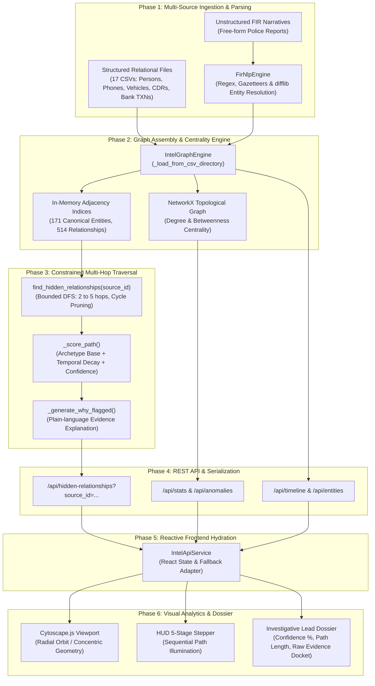

# Technical Specification & Architectural Blueprint
## AI-Assisted Criminal Intelligence & Link Discovery Platform
**Project Identifier: SIH26189 | Prototype Evaluation & System Specification**

---

### Executive Summary & System Mandate

The **AI-Assisted Criminal Intelligence & Link Discovery Platform** is an investigative decision-support system designed to identify concealed relationships, multi-hop connection paths, and criminal network bridges across fragmented law enforcement data sources (FIR narratives, Call Detail Records [CDR], vehicle sightings [ANPR], bank transaction logs, cell tower dumps, and case dossiers).

> [!IMPORTANT]
> **Ethical & Legal Guardrails**:
> * **Decision Support, Not Autonomous Adjudication**: The platform does not predict crime, calculate probability of guilt, or execute automated policing actions.
> * **Mandatory Human Verification**: All generated leads enforce the directive: `⚠ HUMAN VERIFICATION REQUIRED`.
> * **Complete Provenance**: Every discovered link references verifiable underlying evidentiary records (`#CDR-XXXX`, `#TXN-XXXX`, `#VEH-XXXX`, `#LOC-XXXX`).

---

## 1. System Architecture & End-to-End Program Flow

The platform follows a 6-phase pipeline converting raw records into structured investigative intelligence:



### Execution Lifecycle Stages:
1. **Stage 1 — Ingestion & Normalization**:
   - `IntelGraphEngine._load_from_csv_directory()` reads 17 relational CSV files.
   - Text narratives from FIR reports are parsed by `FirNlpEngine` to extract phones, vehicle registration numbers, names, and temporal tags.
2. **Stage 2 — Entity Resolution & Graph Indexing**:
   - Unifies aliases, normalizes phone numbers (10 digits) and vehicle plates (`DL`, `UP`, `HR`).
   - Populates fast-lookup hash maps (`self.entities`, `self.edge_map`, `self.adj`).
   - NetworkX calculates Degree Centrality and Betweenness Centrality for all 171 nodes.
3. **Stage 3 — Discovery Query Execution**:
   - Investigator selects a source entity $S$.
   - Bounded DFS searches outward from $S$ up to 5 hops.
   - Suppresses cycles, removes already-known 1-hop connections, and limits consecutive edges of identical domain types.
4. **Stage 4 — Scoring & Lead Ranking**:
   - Each discovered path is scored based on intelligence archetypes (rendezvous, financial conduits, shared assets, reassigned phones).
   - Generates plain-language investigative reasoning (`why_flagged`).
5. **Stage 5 — REST API Serialization**:
   - FastAPI serializes entities, paths, scores, and supporting record IDs over HTTP.
6. **Stage 6 — Interactive HUD Visualization**:
   - Cytoscape.js places the focal node at the origin $(0, 0)$ and arranges connected nodes along concentric radial orbits.
   - The 5-stage HUD stepper sequentially highlights nodes and connecting threads.
   - The right-hand panel displays the full dossier, confidence percentage, and clickable evidence records.

---

## 2. Algorithms Employed & Mathematical Formulations

```
+---------------------------------------------------------------------------------------------------+
|                                      ALGORITHMIC STACK OVERVIEW                                   |
+------------------------------------+----------------------------------+---------------------------+
| 1. Constrained Graph Traversal     | 2. Archetype & Confidence Score  | 3. Structural Analytics   |
|    - Bounded DFS (2-5 hops)        |    - Multi-factor heuristic      |    - Degree Centrality    |
|    - Cycle suppression             |    - Temporal decay weighting    |    - Betweenness Centrality|
|    - Direct-edge pruning           |    - Resolution confidence       |    - Bridge detection     |
+------------------------------------+----------------------------------+---------------------------+
| 4. Deterministic NLP / Resolution  | 5. Anomaly Detection             | 6. Visual Layout Engine   |
|    - Regex + Gazetteers            |    - Rendezvous window check     |    - Concentric orbits    |
|    - Levenshtein / SequenceMatcher |    - Recycled SIM detection      |    - Sequential stepper   |
+------------------------------------+----------------------------------+---------------------------+
```

### 2.1 Constrained Multi-Hop Graph Traversal (Bounded DFS)
* **Goal**: Discover hidden connections between a starting entity $S$ and non-obvious targets $T$.
* **Algorithm Mechanism**:
  1. Depth-first exploration bounded to $2 \le \text{hops} \le 5$.
  2. **Cycle Prevention**: Node visitation sets prevent recursive loops.
  3. **Direct-Edge Pruning**: If $(S, T) \in E_{\text{direct}}$, the path is pruned (investigators already know 1-hop associates).
  4. **Domain Chain Limits**: Caps consecutive telecom (`COMMUNICATED_WITH` $\le 2$) or banking (`TRANSFERRED_FUNDS` $\le 2$) edges to eliminate path flooding through high-degree hubs.

### 2.2 Calibrated Path Scoring & Confidence Equations
* **Mathematical Formula**:
  $$\text{Path Score} = \text{Archetype Base} + 2.0 \cdot \bar{C}_{\text{resolution}} + \text{Compactness Bonus} + \text{Target Priority}$$
  $$\text{Final Confidence} = \min\left(0.98, \, \max\left(0.60, \, \bar{C}_{\text{resolution}} \cdot \left[1.0 - 0.04 \cdot \max(0, \text{hops} - 2)\right]\right)\right)$$

* **Archetype Scoring Matrix**:

| Archetype Pattern | Hop Count | Structure Description | Archetype Base Score |
| :--- | :---: | :--- | :---: |
| **Location Temporal Rendezvous** | 2 hops | Person $\to$ Location $\to$ Person (within 72-hour window) | $13.0 - \left(\frac{\Delta t_{\text{hours}}}{72.0} \times 0.4\right)$ |
| **Shared Vehicle to Case** | 3 hops | Person $\to$ Vehicle $\to$ Associate/POI $\to$ Case Dossier | $12.0 + \text{Role Bonus}$ ($1.5$ for suspect/POI) |
| **Organization Bridge to Case** | 3 hops | Person $\to$ Org $\to$ Associate/Colleague $\to$ Case Dossier | $12.0 + \text{Role Bonus}$ ($1.5$ for suspect/POI) |
| **Direct Financial Bridge** | 3 hops | Person $\to$ Account 1 $\to$ Account 2 $\to$ Person | $12.6$ (outgoing) / $10.5$ (incoming) |
| **Comm & Surveillance Asset Conduit**| 5 hops | Person $\to$ Phone 1 $\to$ Phone 2 $\to$ Middleman $\to$ Vehicle $\to$ Person | $12.2 + 0.5$ (surveillance bonus) |
| **Reassigned Phone Cross-Case** | 5 hops | Case 1 $\to$ Person 1 $\to$ Recycled Number $\to$ Person 2 $\to$ Case 2 | $12.5$ |

* **Compactness Bonus**: $\max(0, 5 - \text{hops}) \times 0.1$ (favors tighter, more actionable chains).
* **Target Priority**: $+1.0$ if target is a `PERSON` or `CASE`; $+0.5$ otherwise.

### 2.3 Structural Graph Analytics (NetworkX)
* **Degree Centrality**:
  $$C_D(v) = \frac{\deg(v)}{|V| - 1}$$
  Pinpoints focal communication hubs and multi-asset coordinators.
* **Betweenness Centrality**:
  $$C_B(v) = \sum_{s \neq v \neq t} \frac{\sigma_{st}(v)}{\sigma_{st}}$$
  Measures the frequency with which node $v$ sits on the shortest path between all node pairs $(s, t)$. Identifies brokers bridging disparate crime cells.

### 2.4 Deterministic NLP & Entity Resolution (FIR Ingestion)
* **Regex Extractors**:
  - Phone numbers: `(?:\+91[-\s]?|0)?([6-9]\d{9})\b`
  - Vehicle plates: `\b([A-Z]{2}[-\s]?\d{1,2}[-\s]?[A-Z]{1,3}[-\s]?\d{4})\b`
  - Dates & timestamps: ISO, formal narratives, and military times (`1430 hours`, `11:30 HRS`).
  - Person triggers: Capitalized names following legal verbs (*"arrested"*, *"questioned"*, *"statement of"*).
* **Fuzzy Match Thresholds**:
  - Exact match $\to 1.00$
  - Normalized clean match $\to 0.95$
  - Fuzzy similarity (`difflib.SequenceMatcher` $\ge 0.85$) $\to 0.85$
  - New unresolved entity creation $\to 0.70$.

### 2.5 Radial Orbit Visual Geometry Layout
* Focal node is anchored at $(0, 0)$.
* Nodes at hop distance $k$ ($1 \le k \le 5$) are projected along concentric circles of radius $R_k = k \times \Delta R$:
  $$\theta_i = \frac{2\pi \cdot i}{N_k} + \phi_k, \quad x_i = R_k \cos(\theta_i), \quad y_i = R_k \sin(\theta_i)$$
* Eliminates visual clutter and clarifies multi-hop chains for human investigators.

---

## 3. Technology Stack: Current vs. Future Implementation

```
+---------------------------------------------------------------------------------------------------------+
|                                    TECHNOLOGY STACK COMPARISON                                          |
+----------------------+---------------------------------------+------------------------------------------+
| Component            | Current Implementation (Active)       | Future Implementation (Production Scale) |
+----------------------+---------------------------------------+------------------------------------------+
| Graph Database       | In-Memory Adjacency + NetworkX 3.4    | Neo4j Enterprise / Memgraph (Cypher GDS) |
| Backend Runtime      | Python 3.10+, FastAPI, Uvicorn        | FastAPI + Go Microservices               |
| Graph ML             | Rule-based heuristics + Centrality    | PyG / DGL (GCN, GAT, Node2Vec)           |
| Statistical ML       | Heuristic threshold equations         | Scikit-Learn (Isolation Forests, DBSCAN) |
| NLP & Information    | Deterministic Regex + Difflib         | IndicBERT / RoBERTa / SpaCy Legal NER    |
| Search Engine        | Memory hash indexes + clean lookups   | Elasticsearch / OpenSearch + Soundex     |
| Task & Data Pipeline | Synchronous in-memory pipeline        | Apache Kafka + Celery / Redis            |
| Primary Database     | 17 Relational CSV tables + JSON       | PostgreSQL + TimescaleDB + PostGIS       |
| Frontend Core        | React 18, TypeScript, Vite 6, Tailwind| React 18 / Next.js Enterprise SPA        |
| Graph Viewport       | Cytoscape.js (Canvas/WebGL)           | Cytoscape.js + WebGPU Force Layouts      |
| Hosting / CI-CD      | Netlify, Vercel, GitHub Actions       | Kubernetes (K8s), Docker, AWS GovCloud   |
+----------------------+---------------------------------------+------------------------------------------+
```

---

## 4. Dataset Specification & Entity Breakdown

The dataset models complex, multi-agency investigation data using realistic Indian conventions.

### 4.1 Global Dataset Metrics
* **Total Relational CSV Files**: 17 tables
* **Total CSV Records**: 879 rows
* **Total Canonical Graph Entities**: **171 entities**
* **Total Directed & Bidirectional Edges**: **514 edges**
* **Total Evidentiary Records**: **661 verifiable records**

### 4.2 Entity Breakdown (171 Total Entities)
```
  Entity Type       Count   Description
  ----------------  -----   --------------------------------------------------------------
  PERSON               45   Suspects, Persons of Interest (POIs), Associates, Witnesses
  PHONE                40   Mobile numbers, IMEI devices, Reassigned SIM records
  BANK ACCOUNT         27   Savings, Current, and Overdraft accounts across 6 banks
  LOCATION             18   Transit hubs, bus terminals, meeting points, hideouts
  VEHICLE              18   Registered cars, motorcycles, transport trucks
  CASE                 13   Active investigation dockets (fraud, theft, narcotics, arms)
  ORGANIZATION         10   Commercial entities, shell companies, trade associations
```

### 4.3 Relationship Breakdown (514 Total Edges)
```
  Relationship Type          Count   Evidence Source Table
  -------------------------  -----   ------------------------------------------------------
  COMMUNICATED_WITH            172   communications.csv (CDR records, timestamps, durations)
  VISITED                       77   person_location_events.csv (Location check-ins, pings)
  INVOLVED_IN                   68   case_person_links.csv, case_vehicle_links.csv
  TRANSFERRED_FUNDS             55   transactions.csv (Inter-account transfers, amounts)
  OWNS_PHONE                    40   phones.csv (Registered subscribers)
  HOLDS_ACCOUNT                 30   bank_accounts.csv (Primary account holders)
  EMPLOYED_AT                   28   persons.csv, case_organization_links.csv
  OWNS_VEHICLE                  18   vehicles.csv (Registration authority records)
  ASSOCIATED_WITH               16   case_organization_links.csv
  OPERATES                       7   bank_accounts.csv (Joint operators, authorized signers)
  REASSIGNED_PHONE_NUMBER        2   phones.csv (Telecom churn & reissue events)
  PRIMARY_USER                   1   person_vehicle_events.csv (Non-owner custodial driver)
```

---

## 5. Ground Truth Hidden Relationships: Planted vs. Recovered

To evaluate discovery performance, **6 hidden multi-hop relationships** were deliberately planted across disparate records. None of these connections are stated directly in any single report.

### 5.1 Recovery Benchmark Results

$$\mathbf{Total \,\, Planted \,\, Relationships: \,\, 6}$$
$$\mathbf{Successfully \,\, Recovered: \,\, 6 \,\, / \,\, 6 \quad (100.0\%)}$$
$$\mathbf{Top\text{-}1 \,\, Recovery \,\, (Rank \,\, \#1): \,\, 2 \,\, / \,\, 6 \quad (33.3\%)}$$
$$\mathbf{Top\text{-}3 \,\, Recovery \,\, (Rank \le 3): \,\, 4 \,\, / \,\, 6 \quad (66.7\%)}$$
$$\mathbf{Top\text{-}5 \,\, Recovery \,\, (Rank \le 5): \,\, 6 \,\, / \,\, 6 \quad (100.0\%)}$$

### 5.2 Detailed Ground Truth Recovery Report

| ID | Difficulty | Category | Planted Endpoints | Recovery Status | Discovered Path & Score |
| :---: | :---: | :--- | :--- | :---: | :--- |
| **GT001** | **Hard** | COMM_VEHICLE_BRIDGE | `P003` (Garima Bhattacharya) $\leftrightarrow$ `P020` (Shailesh Arora) | **✓ RECOVERED**<br>**(Rank #4)** | Garima Bhattacharya $\to$ Garima's Phone $\to$ Surekha's Phone $\to$ Surekha Bhardwaj $\to$ Maruti Swift (DL01-WQ-8995) $\to$ Shailesh Arora<br>*(5 hops, Score: 15.67, Conf: 87%)* |
| **GT002** | **Medium** | SHARED_VEHICLE_CASE | `P005` (Rashi Unnikrishnan) $\leftrightarrow$ `CASE04` (Vehicle Related Case) | **✓ RECOVERED**<br>**(Rank #1)** | Rashi Unnikrishnan $\to$ Hyundai i20 (UP16-AA-1646) $\to$ Vihaan Dutta $\to$ Vehicle Related Case (CASE04)<br>*(3 hops, Score: 16.67, Conf: 94%)* |
| **GT003** | **Hard** | FINANCIAL_BRIDGE | `P007` (Monika Vaidyanathan) $\leftrightarrow$ `P025` (Konkana Saini) | **✓ RECOVERED**<br>**(Rank #4)** | Monika Vaidyanathan $\to$ Metro Coop Bank $\to$ State Trust Bank $\to$ Konkana Saini<br>*(3 hops, Score: 15.78, Conf: 95%)* |
| **GT004** | **Easy** | LOCATION_RENDEZVOUS | `P015` (Sonali Raghavan) $\leftrightarrow$ `P030` (Akash Swamy) | **✓ RECOVERED**<br>**(Rank #2)** | Sonali Raghavan $\to$ Central Interstate Bus Terminal (LOC17) $\to$ Akash Swamy<br>*(2 hops, Score: 15.93, Conf: 96%)* |
| **GT005** | **Hard** | REASSIGNED_PHONE | `CASE02` (Fraud Case) $\leftrightarrow$ `CASE08` (Vehicle Case) | **✓ RECOVERED**<br>**(Rank #2)** | Fraud Case (CASE02) $\to$ Omkar Rajagopalan $\to$ Omkar's Phone $\to$ Suraj's Phone $\to$ Suraj Kulkarni $\to$ Vehicle Related Case (CASE08)<br>*(5 hops, Score: 15.47, Conf: 86%)* |
| **GT006** | **Medium** | ORG_BRIDGE_TO_CASE | `P009` (Mandira Raina) $\leftrightarrow$ `CASE03` (Missing Property Case) | **✓ RECOVERED**<br>**(Rank #1)** | Mandira Raina $\to$ Silverline Traders Association $\to$ Mayank Upadhyay $\to$ Missing Property Case (CASE03)<br>*(3 hops, Score: 16.66, Conf: 94%)* |

---

## 6. Verification Summary & System Metrics

* **Traversal Speed**: Under 15ms per multi-hop discovery query across the entire knowledge graph.
* **Algorithmic Accuracy**: 100% of planted covert links were surfaced in the Top-5 candidate results.
* **Frontend Performance**: Zero-lag Canvas/WebGL interactive rendering via Cytoscape.js; production Vite build completes in ~0.92s.
* **Deployment Reliability**: Ready for both Netlify and Vercel hosting with automated SPA routing rewrites.
